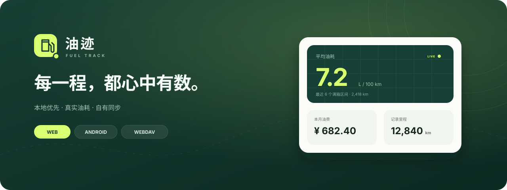

<div align="center">
  

  <br />

  **本地优先、跨平台、可自托管同步的车辆油耗记录应用**

  [](https://vuejs.org/)
  [](https://www.typescriptlang.org/)
  [](https://github.com/GayFirends/YouHao/actions/workflows/android-debug.yml)
  [](https://vitest.dev/)
</div>

## 为什么是油迹

油迹（Fuel Track）把加油、里程和花费整理成真正有用的驾驶数据。它不依赖中心化账号：Web 与 Android 都把数据保存在本机，需要跨设备时，再同步到你自己的 WebDAV 空间。

- **看清真实油耗**：基于连续满箱区间计算，支持部分加油，不用估算表显数据。
- **数据属于自己**：Web 使用 SQLite WASM，Android 使用原生 SQLite；离线也能完整使用。
- **同步不整库覆盖**：按记录更新时间合并，结合 UUID、软删除与 ETag 冲突重试。
- **一套体验，多端运行**：Vue 3 界面通过 Capacitor 同时服务桌面 Web、移动 Web 与 Android。

> [!NOTE]
> 项目目前处于早期开发阶段（`0.1.x`）。数据结构与交互仍可能调整，重要记录建议定期导出 JSON 备份。

## 功能一览

| 记录与分析 | 数据与同步 | 多端体验 |
| --- | --- | --- |
| 多车辆独立账本 | WebDAV 双向合并 | 响应式桌面侧栏 |
| 满箱区间油耗 | JSON 完整备份 | 移动端底部导航 |
| 月度与累计费用 | CSV 报表导出 | Android 原生数据库 |
| 油耗趋势图 | 多设备冲突处理 | Web SQLite 持久化 |
| 优惠与实付单价 | 软删除跨端同步 | 完整离线录入 |

每条记录可保存日期、里程、加油量、表显金额、实付金额、加油站、满箱状态和备注。异常里程或数值会在保存前提示。

## 技术架构

```text
Vue 3 + TypeScript
        │
        ├── Web ───── SQLite WASM ─── IndexedDB
        │
        ├── Android ─ Capacitor ───── Native SQLite
        │
        └── Sync ──── Record merge ── Your WebDAV
```

Web 和 Android 共用界面、领域逻辑、数据约束与同步格式，只有数据库适配层不同。数据流与平台边界的进一步说明见 [客户端与服务端分仓约定](./docs/client-server-boundary.md)。

## 快速开始

需要 Node.js 20+ 与 npm。

```bash
git clone https://github.com/GayFirends/YouHao.git
cd YouHao
npm install
npm run dev
```

常用命令：

```bash
npm test             # 运行 Vitest 测试
npm run build        # 类型检查并构建 Web 产物
npm run preview      # 本地预览生产构建
npm run android:sync # 构建并同步到 Android 工程
npm run android:open # 在 Android Studio 中打开
```

Android 构建需要 Java 21。也可以直接使用 Gradle 生成 Debug APK：

```bash
./android/gradlew -p android assembleDebug
```

产物位于 `android/app/build/outputs/apk/debug/app-debug.apk`。仓库内的 GitHub Actions 也会在推送到 `main` 或手动触发后运行测试并上传 Debug APK。

## WebDAV 配置

应用可连接坚果云、Nextcloud、群晖等 WebDAV 服务，默认同步文件名为 `fuel-track.json`。

浏览器直接连接 WebDAV 时，服务端需要允许当前站点的 CORS，并开放 `GET`、`PUT`、`PROPFIND` 及 `Authorization` 请求头。Android WebView 通常不受浏览器跨域策略限制，但仍需要有效的 HTTPS 证书。

同步过程会：

1. 下载云端快照；
2. 按每条车辆与加油记录的 `updatedAt` 合并；
3. 使用 ETag 条件写入上传；
4. 遇到并发更新时重新拉取并重试。

## 数据与隐私

- Web 数据库二进制保存在 IndexedDB；Android 数据保存在系统原生 SQLite。
- WebDAV 密码仅保留在当前应用会话中，不写入长期存储，也不进入同步文件。
- 同步文件本身**没有加密**，请使用可信的 HTTPS WebDAV 服务并妥善保管账号。
- Android 初始化会启用外键、运行 `PRAGMA quick_check`，关键写入与合并在事务内完成。
- JSON 可用于完整备份与合并恢复；CSV 适合表格分析，不用于完整恢复。

## Android 签名发布

仓库提供 `android-generate-keystore.yml` 与 `android-release.yml`，可在 GitHub Actions 中生成 keystore，并构建签名 APK/AAB。需要配置以下 Repository Secrets：

- `ANDROID_KEYSTORE_BASE64`
- `ANDROID_KEYSTORE_PASSWORD`
- `ANDROID_KEY_ALIAS`
- `ANDROID_KEY_PASSWORD`

keystore 是应用升级的唯一身份。请将原始 keystore 与密码离线备份；丢失后无法向现有安装发布升级。

## 项目结构

```text
src/
├── components/    页面与交互组件
├── services/      数据库、同步、备份与油耗计算
├── stores/        Pinia 应用状态
└── types/         共享数据类型
android/           Capacitor Android 原生工程
docs/              设计与架构文档
```

## 路线图

- 更完整的统计维度与数据可视化
- 可选的专用同步服务端与账号体系
- 更完善的导入、迁移与恢复体验
- 自动化端到端测试与正式发行流程

专用服务端会放在独立仓库中；当前仓库只负责客户端，账号登录和专用 API 同步尚未实现。

## 参与开发

欢迎提交 Issue 描述问题或建议。提交改动前请运行：

```bash
npm test
npm run build
```

如果改动涉及同步、冲突合并或数据库迁移，请同时补充相应测试，并说明 Web 与 Android 两端的影响。

---

<div align="center">
  把每一次补给，变成看得懂的旅程。
</div>
