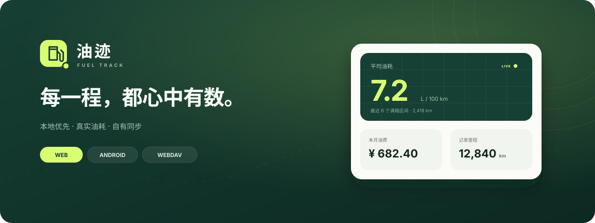

<div align="center">
  

  <br />

**本地优先、单一 Android 应用、可自托管同步的车辆油耗记录应用**

[](https://kotlinlang.org/)
[](https://developer.android.com/jetpack/compose)
[](https://github.com/GayFirends/YouHao/actions/workflows/android-debug.yml)
[](./LICENSE)
</div>

## 为什么是油迹

油迹（Fuel Track）把加油、里程和花费整理成真正有用的驾驶数据。它不依赖中心化账号：所有数据保存在手机本地，需要跨设备时，再同步到你自己的 WebDAV 空间。

- **看清真实油耗**：基于连续满箱区间计算，支持部分加油，不用估算表显数据。
- **数据属于自己**：数据保存在本机 SQLite（Room）中，飞行模式也能完整使用。
- **同步不整库覆盖**：按记录更新时间合并，结合 UUID、软删除与 ETag 条件写入处理并发。
- **纯粹的 Android 应用**：Kotlin + Jetpack Compose 原生界面，没有 WebView，没有远程页面加载。

> [!NOTE]
> 项目目前处于早期开发阶段（`0.2.x`）。数据结构与交互仍可能调整，重要记录建议定期导出 JSON 备份。

> [!IMPORTANT]
> `0.2.0` 是重写后的第一个原生版本。此前基于 Vue + Capacitor 的 WebView 版本已从仓库移除，两者**不共享本地数据库**：原生版使用全新的 `fueltrack.db`，不会自动读取旧版的 `fuel-track` 数据库。首次升级请从旧版导出 JSON 备份，再在原生版中导入。

## 功能一览

| 记录与分析     | 数据与同步        | 应用体验             |
| -------------- | ----------------- | -------------------- |
| 多车辆独立账本 | WebDAV 双向合并   | 原生 Jetpack Compose |
| 满箱区间油耗   | JSON 完整备份     | 概览 / 记录 / 车辆 / 设置四个标签页 |
| 月度与累计费用 | CSV 报表导出      | 后台定时同步（WorkManager） |
| 里程与单价提示 | 多设备冲突处理    | 深色模式             |
| 优惠与实付单价 | 可选端到端加密    | 完整离线录入         |

每条记录可保存日期、里程、加油量、表显金额、实付金额、加油站、满箱状态和备注。异常里程或数值会在保存前提示。

## 技术架构

```text
app/                 Android 应用（Kotlin + Compose）
├── ui/              概览、记录、编辑器、车辆、设置、冲突
├── data/local/      Room 实体、DAO、数据库
├── data/prefs/      DataStore 设置 + Keystore 记忆口令
├── data/sync/       WebDAV 传输、同步引擎、WorkManager
├── data/backup/     SAF 文件读写
└── data/diagnostics/脱敏诊断报告

domain/              纯 Kotlin 领域层，不依赖 Android
├── model/           Vehicle、FuelRecord、同步容器
├── calc/            油耗、价格与录入联动
├── query/           排序、筛选、游标分页
├── sync/            合并、冲突、校验、加密容器
├── backup/          JSON 校验与 CSV 生成
└── time/            时间戳与本地日期键
```

领域层是一个独立的 JVM 模块，因此油耗计算、同步合并和备份格式都能在没有设备或模拟器的情况下用单元测试覆盖。

**关键技术选型**

| 关注点   | 方案                                          |
| -------- | --------------------------------------------- |
| 界面     | Jetpack Compose + Material 3                  |
| 本地存储 | Room（SQLite），写入统一使用 `@Upsert`        |
| 设置     | DataStore Preferences                         |
| 机密     | Android Keystore（AES-256-GCM）               |
| 网络     | OkHttp，条件写入使用 ETag / Last-Modified     |
| 后台任务 | WorkManager，每 6 小时一次，仅在有网络时执行（需先记住密码） |
| 序列化   | kotlinx.serialization                         |

## 快速开始

需要 JDK 21（Android Studio 自带的 JBR 即可）与 Android SDK（`compileSdk 37`）。最低支持 Android 8.0（API 26）。

```bash
git clone https://github.com/GayFirends/YouHao.git
cd YouHao

# 指向你的 SDK（local.properties 已被 gitignore）
echo "sdk.dir=/path/to/Android/Sdk" > local.properties

./gradlew :app:assembleDebug
```

产物位于 `app/build/outputs/apk/debug/app-debug.apk`。

常用命令：

```bash
./gradlew :domain:test              # 领域层单元测试（最快，无需 Android SDK 设备）
./gradlew :app:testDebugUnitTest    # 同步引擎与数据层单元测试
./gradlew :app:lintDebug            # Android Lint
./gradlew :app:assembleRelease      # R8 压缩后的 release 构建
```

仓库内的 GitHub Actions 会在推送到 `main` 或手动触发后运行单元测试、Lint 与 Debug 构建，并上传 APK。中文界面的文案直接写在 Compose 代码里，不引入图标字体依赖。

## WebDAV 配置

应用可连接坚果云、Nextcloud、群晖等 WebDAV 服务，默认同步文件名为 `fuel-track.json`。

在“设置”页填写地址、用户名与应用密码后，可先“测试连接”，再“立即同步”。同步过程会：

1. 下载云端快照；
2. 按每条车辆与加油记录的 `updatedAt` 合并；
3. 使用 ETag（或 `Last-Modified`）条件写入上传；
4. 遇到并发更新（HTTP 412）时重新拉取并重试，最多 3 轮。

地址必须是 HTTPS；只有 `localhost` 与 `127.0.0.1` 允许明文 HTTP，便于本机调试。

## 数据与隐私

- 数据保存在应用私有的 Room 数据库 `fueltrack.db` 中。
- WebDAV 密码与同步口令默认只保留在当前进程内，不写入长期存储，也不进入同步文件。
- 两者都可以选择记住：打开「记住口令」或「记住密码以便后台同步」后，密文由 Android Keystore 的 AES-256-GCM 密钥保护；Keystore 不可用时应用会降级为“什么都不记住”，而不是崩溃。
- 只有记住密码之后，每 6 小时的后台同步才能在进程被系统回收后完成认证；否则后台任务会跳过本次同步，既不报错也不重试。
- 同步文件默认**没有加密**，请使用可信的 HTTPS WebDAV 服务并妥善保管账号。可在设置中启用 v2 加密容器。
- 数据库启动时会启用外键并运行 `PRAGMA quick_check`；关键写入与合并在事务内完成。
- JSON 可用于完整备份与合并恢复；CSV 适合表格分析，不用于完整恢复。

详细操作见[数据恢复与升级](./docs/data-recovery.md)、[同步加密](./docs/sync-encryption.md)和[发布兼容政策](./docs/release-policy.md)。

## Android 签名发布

仓库提供 `android-generate-keystore.yml` 与 `android-release.yml`，可在 GitHub Actions 中生成 keystore，并构建签名 APK/AAB。需要配置以下 Repository Secrets：

- `ANDROID_KEYSTORE_BASE64`
- `ANDROID_KEYSTORE_PASSWORD`
- `ANDROID_KEY_ALIAS`
- `ANDROID_KEY_PASSWORD`

本地 `./gradlew :app:assembleRelease` 不需要这些变量，会产出未签名的 APK；只要设置了 `ANDROID_KEYSTORE_PATH`，release 构建就会自动签名。

keystore 是应用升级的唯一身份。请将原始 keystore 与密码离线备份；丢失后无法向现有安装发布升级。

## 项目结构

```text
app/                Android 应用模块（Compose UI、Room、同步、备份）
domain/             纯 Kotlin 领域模块与单元测试
docs/               设计与架构文档
tools/interop/      与旧版 WebView 客户端互操作验证脚本
gradle/             版本目录（libs.versions.toml）
```

## 从旧版迁移

旧的 Vue + Capacitor 版本与原生版是两套独立的本地存储：

1. 在旧版中进入“数据与同步”，导出 JSON 备份；
2. 安装原生版；
3. 在“设置 → 备份与导出 → 导入备份”中选择该 JSON 文件。

导入是**合并**而不是替换：与同步引擎使用同一套 last-writer-wins 规则，较新的记录优先，删除标记同样保留，因此恢复旧备份不会把已删除的记录带回来。

`tools/interop/` 下的脚本用于双向验证 v2 加密容器（旧版写入、Kotlin 读取，以及反向）。它们依赖已删除的旧 `src/` 目录，只有在从 git 历史取回旧树后才能重新运行；已入库的 `domain/src/test/resources/sync-crypto-reference.json` 是 Kotlin 测试使用的权威夹具。

## 路线图

- 更完整的统计维度与数据可视化
- 从旧版 Capacitor 数据库直接导入的一次性迁移工具
- 可选的专用同步服务端与账号体系
- iOS 版本
- 更细致的无障碍支持

专用服务端会放在独立仓库中；当前仓库只负责客户端，账号登录和专用 API 同步尚未实现，边界见[客户端与服务端分仓约定](./docs/client-server-boundary.md)。

## 参与开发

欢迎提交 Issue 描述问题或建议。提交改动前请运行：

```bash
./gradlew :domain:test :app:testDebugUnitTest
./gradlew :app:lintDebug
```

如果改动涉及同步、冲突合并或数据库迁移，请同时补充相应测试。完整说明见 [参与贡献](./CONTRIBUTING.md)。发现安全问题时，请按照[安全策略](./SECURITY.md)私密报告，不要在公开 Issue 中附带凭据或真实备份。

## 开源许可

本项目使用 [MIT License](./LICENSE)。

---

<div align="center">
  把每一次补给，变成看得懂的旅程。
</div>
